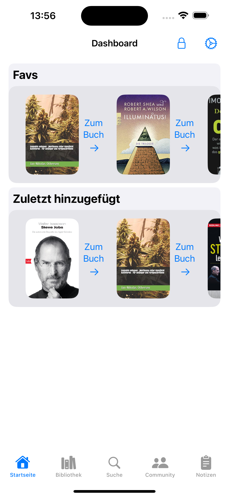

# BookVault

**Mit BookVault behältst Du den Überblick über Deine Bücher, Leseerlebnisse und findest immer das Richtige, wenn Du es brauchst.**

Hast Du schon wieder ein Buch doppelt gekauft oder hast Du es gleich im Laden liegen lassen, weil Du nicht wusstest, ob Du es schon besitzt? BookVault hilft Dir, Deinen Buchbestand immer Griffbereit zu haben, Deine Leseerlebnisse und Ergebnisse festzuhalten, und verschiedene Bücherlisten zu verwalten, wie Beispielsweise Bestands- und Wunschliste, sowie Listen für geliehene und verliehene Bücher.

Die App ermöglicht Dir detailierte Notizen, Gedanke und Zitate für jedes einzelne Buch festzuhalten. Der Barcode-Scanner erlaubt es Dir Deine Bücher schnell und einfach mit einer online Datenbank abzugleichen. Dadurch fügst Du Deine Bücher der BookVault Bibliothek blitzschnell hinzu.

## Geplantes Design
Füge hier einige repräsentative Designs deiner App ein (z.B. aus Figma).
Wenn deine App dann so weit ist, dass du echte Screenshots machen kannst, solltest du diese hier einsetzen.

  
  
  

## Features
Hier kommen alle geplanten Features der App rein mit dem Status, ob es bereits umgesetzt wurde.

- [ ] ISBN-Suche
- [ ] Bücherlisten (Bestand, Wunsch, Geliehen, Verliehen + eigene)
- [ ] Buchnotizen
- [ ] Themensortierte, buchübergreifende Notizsammelbecken
- [ ] Barcode-Scanner
- [ ] Favoriten setzen
- [ ] Bücherbewertungen Appintern
- [ ] Empfehlungen neuer Bücher nach Geschmack 
- [ ] Gruppen zum Austausch über Bücher/ Themen
- [ ] Schwarzesbrett für Bücher: Kauf- und Leihbörse

## Technischer Aufbau

#### Projektaufbau
Eine kurze Beschreibung deiner Ordnerstruktur und Architektur (MVVM, Repositories?) um Außenstehenden zu helfen, sich in deinem Projekt zurecht zu finden.

#### Datenspeicherung
Welche Daten speicherst du? Wo und wie (Firebase, Core Data, etwas anderes)?

Es werden Daten Lokal in CoreData gespeichert, für offline Unterstützung und in Firebase um geräteübergreifend arbeiten zu können.

#### API Calls
Welche APIs verwendest du?

ISBNdb.com

#### 3rd-Party Frameworks
Verwendest du Frameworks, die nicht von dir stammen? Bspw. Swift Packages für Firebase, fertige SwiftUI-Views o.Ä.? Gib diese hier an.

## Ausblick
Beschreibe hier, wo die Reise nach deinem Praxisprojekt hin geht. Was möchtest du in Zukunft noch ergänzen? Erstelle auch hierzu Issues und verlinke sie, wie oben.
 
