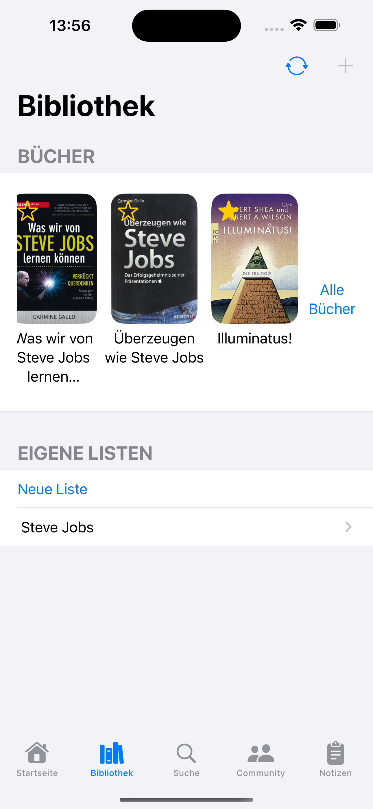

# ReadersVault

**Mit ReadersVault behältst Du den Überblick über Deine Bücher, Leseerlebnisse und findest immer das Richtige, wenn Du es brauchst.**

Hast Du schon wieder ein Buch doppelt gekauft oder hast Du es gleich im Laden liegen lassen, weil Du nicht wusstest, ob Du es schon besitzt? ReadersVault hilft Dir, Deinen Buchbestand immer Griffbereit zu haben, Deine Leseerlebnisse und Ergebnisse festzuhalten, und verschiedene Bücherlisten zu verwalten, wie Beispielsweise Bestands- und Wunschliste, sowie Listen für geliehene und verliehene Bücher.

Die App ermöglicht Dir detailierte Notizen, Gedanken und Zitate für jedes einzelne Buch festzuhalten und auch thematisch zu gruppieren. So hast Du immer Zugriff auf alle Notizen eines Buches oder eines Themas. Der Barcode-Scanner erlaubt es Dir Deine Bücher schnell und einfach mit einer online Datenbank abzugleichen. Dadurch fügst Du Deine Bücher der ReadersVault Bibliothek blitzschnell hinzu.

## Geplantes Design
Screenshots aus dem Simulator:

<p>
  
  
  
  
</p>


## Features
Die folgenden Features sind geplant und, sofern abgehakt, bereits implementiert.

- [x] ISBN-Suche
- [x] Bücherlisten (Bestand, Wunsch, Geliehen, Verliehen + eigene)
- [x] Buchnotizen
- [x] Themensortierte, buchübergreifende Notizsammelbecken (Vaults)
- [x] Barcode-Scanner
- [x] Favoriten setzen


## Technischer Aufbau

#### Projektaufbau
Jede View erhält ihren eigenen Ordner, wo die View und SubViews, sowie das ViewModel enthalten sind. Die App benutzt die MVVM Architektur und benutzt Repositorys.

```
└── BookVault
    ├── GoogleService-Info.plist
    ├── Models
    │   ├── ApiModel
    │   │   ├── ApiAuthorsResult.swift
    │   │   ├── ApiBook.swift
    │   │   ├── ApiBookResult.swift
    │   │   └── ApiTitlesResult.swift
    │   ├── CoreData
    │   │   ├── BookVault.xcdatamodeld
    │   │   │   └── BookVault.xcdatamodel
    │   │   │       └── contents
    │   │   └── PersistentStore.swift
    │   ├── Enums
    │   │   ├── ElementType.swift
    │   │   ├── NavigationValue.swift
    │   │   └── Tab.swift
    │   ├── Extensions
    │   │   ├── CDBook+Extension.swift
    │   │   ├── CDCategory+Extension.swift
    │   │   ├── CDList+Extension.swift
    │   │   ├── CDVault+Extension.swift
    │   │   ├── String+Extension.swift
    │   │   ├── UTType+Extension.swift
    │   │   ├── Widget+Transferable.swift
    │   │   └── WidgetElement+Transferable.swift
    │   ├── Firebase
    │   │   ├── FireBook.swift
    │   │   ├── FireBulletinBoardPost.swift
    │   │   ├── FireGroup.swift
    │   │   ├── FireGroupPost.swift
    │   │   └── FireUser.swift
    │   └── HomeView
    │       ├── Widget.swift
    │       ├── WidgetBook.swift
    │       ├── WidgetElement.swift
    │       └── WidgetList.swift
    ├── ReadersVaultApp.swift
    ├── Repositories
    │   ├── ApiRepository
    │   │   ├── ApiError.swift
    │   │   └── ApiRepository.swift
    │   └── ScannerRepository
    │       └── ScannerRepository.swift
    └── Views
        ├── Common
        │   ├── BooksSelectionView
        │   │   ├── BooksSelecitonViewModel.swift
        │   │   └── BooksSelectionView.swift
        │   ├── CategoriesSelectionView
        │   │   ├── CategoriesSelectionSubViews
        │   │   │   └── CreateCategoryView.swift
        │   │   ├── CategoriesSelectionView.swift
        │   │   └── CategoriesSelectionViewModel.swift
        │   ├── NotesSelectionView
        │   │   ├── NotesSelectionView.swift
        │   │   └── NotesSelectionViewModel.swift
        │   └── TagsSelectionView
        │       ├── TagsSelectionSubViews
        │       │   └── CreateTagView.swift
        │       ├── TagsSelectionView.swift
        │       └── TagsSelectionViewModel.swift
        ├── Community
        │   ├── BulletinBoardView
        │   │   ├── BulletinBoardView.swift
        │   │   └── BulletinBoardViewModel.swift
        │   ├── CommunityDashboardView
        │   │   ├── CommunityDashboardSubViews
        │   │   │   ├── CommunityBlackboardView.swift
        │   │   │   └── CommunityGroupsView.swift
        │   │   ├── CommunityDashboardView.swift
        │   │   └── CommunityDashboardViewModel.swift
        │   ├── CommunityNavigatorView
        │   │   └── CommunityNavigatorView.swift
        │   ├── GroupsView
        │   │   ├── GroupsView.swift
        │   │   └── GroupsViewModel.swift
        │   ├── LoginView
        │   │   ├── LoginView.swift
        │   │   └── LoginViewModel.swift
        │   ├── MessagesView
        │   │   └── MessagesView.swift
        │   ├── ProfileView
        │   │   └── ProfileView.swift
        │   └── VerificationPendingView
        │       └── VerificationPendingView.swift
        ├── Home
        │   └── HomeView
        │       ├── HomeSubViews
        │       │   ├── HomeElementView.swift
        │       │   ├── HomeList.swift
        │       │   ├── HomeListsView.swift
        │       │   ├── HomeSettingsSheetView.swift
        │       │   ├── HomeSingleListView.swift
        │       │   ├── HomeStatsView.swift
        │       │   ├── HomeWidgetElementSelectionView.swift
        │       │   ├── HomeWidgetView.swift
        │       │   └── WidgetElements
        │       │       ├── HomeAddedLastBooksView
        │       │       │   ├── HomeAddedLastBooksView.swift
        │       │       │   └── HomeAddedLastBooksViewModel.swift
        │       │       ├── HomeBooksView
        │       │       │   ├── HomeBooksView.swift
        │       │       │   ├── HomeBooksViewModel.swift
        │       │       │   └── HomeSingleBookView.swift
        │       │       └── HomeFavListView
        │       │           ├── HomeFavListView.swift
        │       │           └── HomeFavListViewModel.swift
        │       ├── HomeView.swift
        │       └── HomeViewModel.swift
        ├── Library
        │   ├── AllBookListView
        │   │   ├── AllBookListSubViews
        │   │   │   └── AllBookListNewBookView.swift
        │   │   ├── AllBookListView.swift
        │   │   └── AllBookListViewModel.swift
        │   ├── AuthorSelectionView
        │   │   ├── AuthorSelectionSubViews
        │   │   │   └── CreateAuthorView.swift
        │   │   ├── AuthorSelectionView.swift
        │   │   └── AuthorSelectionViewModel.swift
        │   ├── BookDetailView
        │   │   ├── BookDetailSubViews
        │   │   │   ├── BookDetailEditView
        │   │   │   │   └── BookDetailEditView.swift
        │   │   │   ├── BookDetailSyncView
        │   │   │   │   ├── BookDetailSyncView.swift
        │   │   │   │   └── BookDetailSyncViewModel.swift
        │   │   │   ├── BookNewNoteView
        │   │   │   │   └── BookNewNoteView.swift
        │   │   │   └── BookToListView
        │   │   │       └── BookToListView.swift
        │   │   ├── BookDetailView.swift
        │   │   └── BookDetailViewModel.swift
        │   ├── BookListDetailView
        │   │   ├── BookListDetailSubViews
        │   │   │   ├── BookListAddBookView
        │   │   │   │   ├── BookListAddBookView.swift
        │   │   │   │   └── BookListAddBookViewModel.swift
        │   │   │   └── BookListDetailEditView.swift
        │   │   ├── BookListDetailView.swift
        │   │   └── BookListDetailViewModel.swift
        │   ├── LibraryView
        │   │   ├── LibrarySubViews
        │   │   │   ├── HorizontalBookListView.swift
        │   │   │   ├── LibrarySyncView
        │   │   │   │   ├── LibrarySyncView.swift
        │   │   │   │   └── LibrarySyncViewModel.swift
        │   │   │   └── VerticalBookListsView.swift
        │   │   ├── LibraryView.swift
        │   │   └── LibraryViewModel.swift
        │   ├── NewBookEditView
        │   │   ├── NewBookEditSubViews
        │   │   │   └── CustomTextField.swift
        │   │   ├── NewBookEditView.swift
        │   │   └── NewBookEditViewModel.swift
        │   └── NewListEditView
        │       ├── NewListEditView.swift
        │       └── NewListEditViewModel.swift
        ├── NavigatorView
        │   └── NavigatorView.swift
        ├── Notes
        │   ├── NoteDetailView
        │   │   ├── NoteDetailView.swift
        │   │   └── NoteDetailViewModel.swift
        │   ├── NotesBookSelectionView
        │   │   └── NotesBookSelectionView.swift
        │   ├── NotesEditView
        │   │   └── NotesEditView.swift
        │   └── NotesListView
        │       ├── NotesListSubViews
        │       │   └── CustomSearchBar.swift
        │       ├── NotesListView.swift
        │       └── NotesListViewModel.swift
        ├── Search
        │   ├── SafariView
        │   │   └── SafariView.swift
        │   ├── ScannerView
        │   │   ├── DocumentScannerView.swift
        │   │   ├── RoundedRectLabel.swift
        │   │   └── ScannerViewModel.swift
        │   └── SearchView
        │       ├── SearchView.swift
        │       ├── SearchViewModel.swift
        │       └── SearchViewSubViews
        │           ├── AuthorsResultView.swift
        │           ├── BooksResultView.swift
        │           ├── ScannerSearchBar.swift
        │           └── SingleBookResultView.swift
        └── Vaults
            ├── VaultDetailView
            │   ├── VaultDetailSubViews
            │   │   ├── VaultDetailBookItemView.swift
            │   │   └── VaultDetailHorizontalView.swift
            │   ├── VaultDetailView.swift
            │   └── VaultDetailViewModel.swift
            └── VaultListView
                ├── VaultListSubViews
                │   └── CreateVaultSheetView.swift
                ├── VaultListView.swift
                └── VaultListViewModel.swift

```

Eine kurze Beschreibung deiner Ordnerstruktur und Architektur (MVVM, Repositories?) um Außenstehenden zu helfen, sich in deinem Projekt zurecht zu finden.

#### Datenspeicherung
Es werden Daten über die einzelnen Bücher und Bücherlisten gespeichert, Lokal in CoreData und bei Anmeldung in der App in FireBase übertragen. Später werden Bewertungen und Kommentare, Gruppen für Bücher ebenfalls in FireBase gespeichert.

#### API Calls
Es wird die API von ISBNdb.com benutzt.

#### 3rd-Party Frameworks
Firebase


## Ausblick
Für die Zukunft sind die folgenden Features geplant:

- [ ] Bücherbewertungen Appintern
- [ ] Empfehlungen neuer Bücher nach Geschmack 
- [ ] Gruppen zum Austausch über Bücher/ Themen
- [ ] Schwarzesbrett für Bücher: Kauf- und Leihbörse

Es besteht ebenfalls die Möglichkeit eine Webapplikation bereitzustellen, damit die Benutzer auch über Desktopgeräte sich anmelden können und ihre Bibliothek und Buchnotizen immer griffbereit haben.

Außerdem ist geplant die App mit der Amazon Partnernet API auszustatten um Einnahmen über Empfehlungen zu generieren.

Auch besteht die Möglichkeit den Benutzern zu ermöglichen ihre Notizen zu Büchern zu veröffentlichen, damit Menschen sich ein Bild vom Inhalt des Buches machen können, bevor sie es kaufen. (Ähnlich dem Konzept von Blinkist.)
